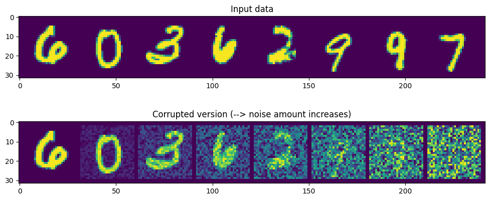

# Diffusion Playground
Welcome to my diffusion playground! 🚀 This repository is dedicated to my journey into the fascinating world of diffusion models. Starting with the simplest possible version of a denoising algorithm, I aim to progressively explore, understand, and implement increasingly complex versions of these algorithms.

This is more than just a learning project—it's a hands-on exploration of the mathematical foundations, practical applications, and creative possibilities of diffusion models. I'll document each step, sharing insights, challenges, and breakthroughs along the way.

If you're curious about diffusion models, their inner workings, or their applications in generative modeling, this repository will grow into a resource for learners and enthusiasts alike.

Let’s dive into diffusion!

The project is currently in active development.

## Project Structure
- **`toy_diffusion.ipynb`**: A very basic implementation a diffusion model

- **`DDPM.ipynb`**: A diffusion implementation based on the paper [Denoising Diffusion Probabilistic Models](https://arxiv.org/abs/2006.11239)

- **`Secondary files:`**:
    - **`helper_functions.py:`**: Helper functions for the project
  

## Results

## Toy Diffusion

Features of the algorithm design used in toy_diffusion:
* The architecture of the model is a very basic version of a U-Net.
* Spatial up-sampling and down-sampling don't use learnable parameters.
* Given a noisy (corrupted) version of a clean image the model tries to predict the clean image directly.
* The amount of noise added to each input during training is random and does not follow a schedule.
* The sampling strategy used is a very basic one, making smaller steps in the backward process when the input is very noisy and larger steps when it is cleaner.

The forward (corruption) process fro toy_diffusion:

  

The denoiser inputs and outputs:

  

Sampling with the denoiser with five steps:

  

Sampling with the denoiser with twenty steps:

  

References for toy_diffusion:
- &nbsp; The notebook follows the [Diffusion Models from Scratch](https://huggingface.co/learn/diffusion-course/en/unit1/3) notebook in the Hugging Face Diffusion course, but the U-Net used is implemented in a different way - using two layers of 3X3 convolutions instead of one layer of 5X5 and without making use of torch.nn.ModuleList to access layers by index(the goal is to make the architecture more transparent).

## DDPM Diffusion

References for DDPM diffusion:
- &nbsp; The U-Net used is the based on Phil Wang's [implementation](https://github.com/lucidrains/denoising-diffusion-pytorch)- which itself is based on [the original TensorFlow implementation](https://github.com/hojonathanho/diffusion).

### Paper and Blog References:

#### Papers:
- [x] [U-Net: Convolutional Networks for Biomedical Image Segmentation](https://arxiv.org/abs/1505.04597)  
- [x] [An Introduction to Variational Autoencoders](https://arxiv.org/abs/1906.02691) 
- [x] [Understanding Diffusion Models: A Unified Perspective](https://arxiv.org/abs/2208.11970)
- [x] [Denoising Diffusion Probabilistic Models](https://arxiv.org/abs/2006.11239)

#### Blogs and other resources:
- &nbsp; [Hugging Face Diffusion Models Course](https://huggingface.co/learn/diffusion-course/unit0/1)
- &nbsp; [A university course by the Israel Institute of Technology, taught by Michael Elad](https://www.youtube.com/playlist?list=PL0H3pMD88m8XPBlWoWGyal45MtnwKLSkQ)

